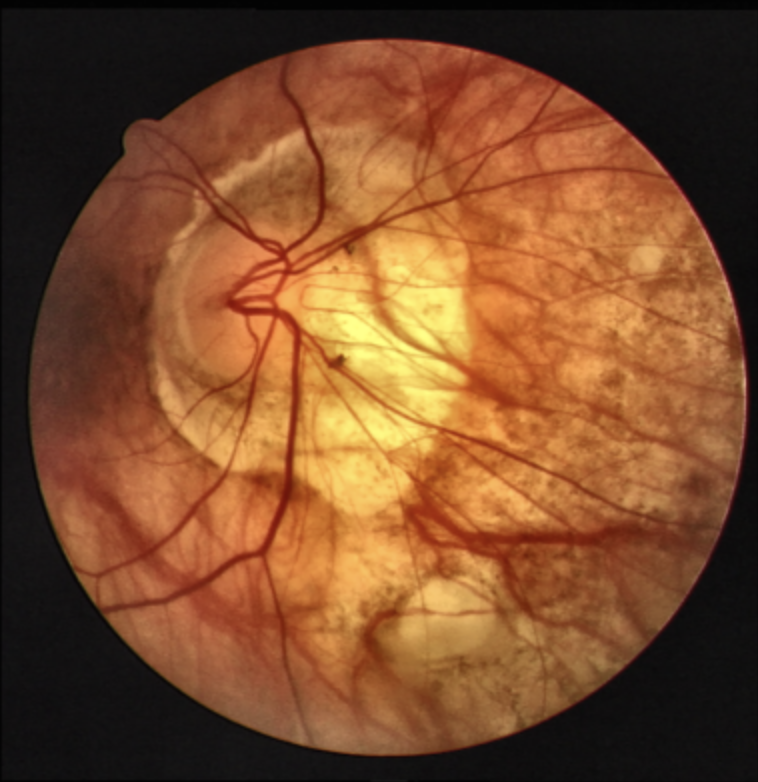
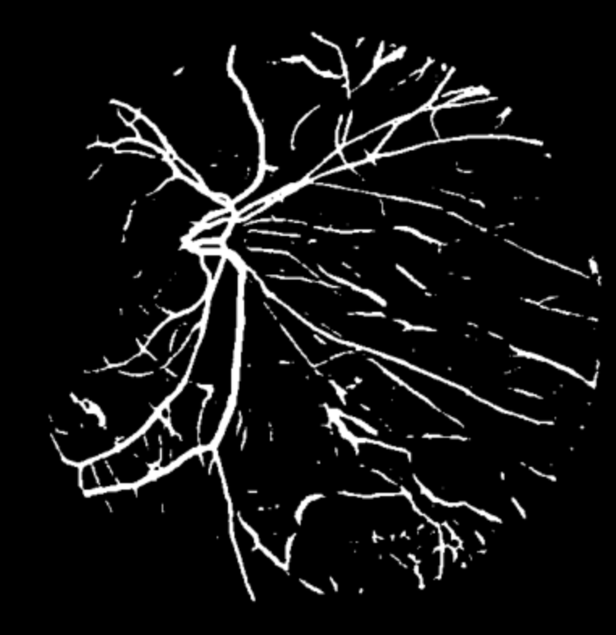
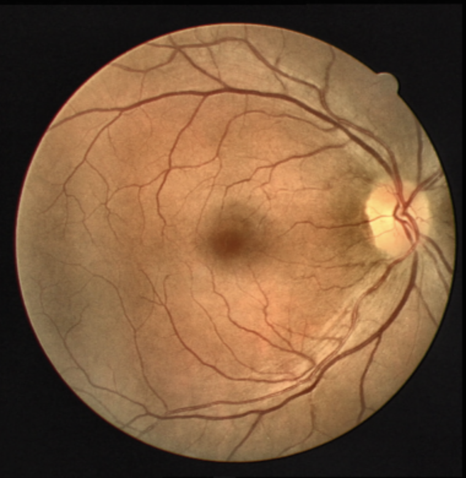

# Attention U-Net for Retinal Blood Vessel Segmentation

This repository contains the PyTorch implementation of **Attention U-Net** applied to the **DRIVE dataset** for blood vessel segmentation in retinal images. The model is based on the paper:

> Oktay et al., "Attention U-Net: Learning Where to Look for the Pancreas," [arXiv:1804.03999](https://arxiv.org/pdf/1804.03999.pdf).

The implementation is inspired by the **Towards Data Science** tutorial by **Hong Jing**, which provides a detailed step-by-step guide for biomedical image segmentation using Attention U-Net.

## 📌 **Project Overview**
Retinal blood vessel segmentation is crucial for the diagnosis and treatment of various cardiovascular and ophthalmologic diseases, including:
- **Diabetic Retinopathy**
- **Hypertension**
- **Arteriosclerosis**
- **Choroidal Neovascularization**

The DRIVE dataset is widely used for comparative studies in retinal vessel segmentation and morphological analysis of retinal blood vessels.

### **Why Attention U-Net?**
The **Attention U-Net** architecture improves standard U-Net by introducing attention gates, which help the model focus on relevant regions in the image, leading to:
- **Better segmentation accuracy**
- **Reduced false positives**
- **Improved focus on small vessels**


(change stuff here)

## 🏗 **Project Structure**
```
├── notebook.ipynb       # Jupyter Notebook (Full project walkthrough & visualization)
├── main.py              # Model implementation (Attention U-Net)
├── utils.py             # Helper functions
├── train.py             # Training script
├── loss.py              # Evaluation script
├── dataset.py           # Dataset Loading 
└── README.md            # Project documentation
```

## 📊 **Results & Visualizations**
The model produces accurate segmentation of blood vessels. Sample results:

| Input Image | Ground Truth | Prediction |
|------------|--------------|-----------|
|  |  |  |
|  |  |  |
|  |  |  |
|  |  |  |

## 🔬 **Key Features**
✅ **Attention Mechanism**: Focuses on important regions in the image.  
✅ **Dice Loss & Focal Loss**: Handles class imbalance effectively.  
✅ **Data Augmentation**: Improves model generalization.  
✅ **PyTorch Dataset Class**: Efficient data loading & preprocessing.  

## 🔗 **References**
- **[Attention U-Net Paper](https://arxiv.org/pdf/1804.03999.pdf)**
- **[DRIVE Dataset](https://drive.grand-challenge.org/)**

---
Feel free to contribute by submitting pull requests or opening issues! 🚀


